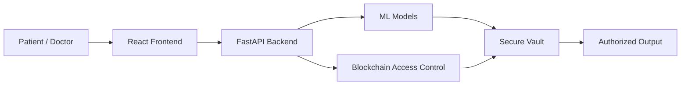

CoC Inheritance 2025  
MedBlocks: Secure Medical Records with Intelligent Insights  
By Hermits  

---

## 📝 Description

MedBlocks is a secure healthcare platform that allows patients to upload medical reports and leverage AI to predict health risks, generate easy-to-understand summaries, and analyze medication adherence. The system ensures patient ownership and privacy of medical data through controlled access and secure digital storage. It is built using machine learning models, blockchain-based wallet identity, FastAPI for backend services, and a React-based frontend.

---

## 🔗 Links

[GitHub Repository](https://github.com/PratikShewale21/medblocks.git)  
[Demo Video](To be updated)  
[Project Screenshots/Drive](To be updated)  
[Hosted Website](To be updated)  

---

## 🤖 Tech-Stack

**Frontend**
- React.js
- HTML5, CSS3, JavaScript (ES6+)
- Axios, React Router
- Web3.js

**Backend**
- FastAPI
- Python
- Uvicorn
- Pydantic

**Machine Learning**
- PyTorch
- scikit-learn
- Transformers (BioBERT)
- Joblib
- PDF processing: PyPDF2, pdfplumber, Regex

**Blockchain & Security**
- Solidity Smart Contracts
- Web3.py
- Wallet-based authentication (MetaMask)
- IPFS with Pinata
- Cryptography, JWT, HTTPS

---

## 🏗️ System Architecture



## 📈 Progress

### Fully Implemented Features
- Diabetes prediction from uploaded medical PDFs using machine learning.
- Medical report summarization for improved patient understanding.
- Medication adherence analysis.
- Secure encrypted vault for medical record storage.
- Patient-side access sharing and revocation.

### Partially Implemented / Work in Progress
- Doctor-side dashboard to view shared records and AI-generated insights.

---

## 🔮 Future Scope

- Integration of a doctor directory to replace manual wallet address entry.
- Expansion of ML models for multi-disease prediction and advanced health risk analysis.
- Smart contracts for automated consent logging and audit trails.
- Enhanced doctor dashboard with annotations and treatment recommendations.
- Support for mobile applications and wearable device data integration.

---

## 💸 Applications

Doctors – Secure storage of patient records with AI-assisted risk prediction and controlled inter-department sharing.  

Patients – Faster understanding of medical reports using AI summaries with secure and revocable patient-controlled access.  


---

## 🛠 Project Setup
1. Clone the repository 
```
git clone https://github.com/PratikShewale21/medblocks
```
2. Enter the project directory and install dependencies 

```
cd medblocks
```
Frontend dependencies : 
```
cd medlocksreact
npm install
```

ML dependencies : 
``` 
cd .. #move back to medblocks
cd ML_folder
pip install -r requirements.txt
```
Blockchain dependencies :
```
cd .. #move back to medblocks
cd Inheritance-backend
pip install -r requirements.txt
```


### Frontend

    
    bash
    cd medblocks-react
    npm start
    

### ML Backend
    
    cd ML_folder
    uvicorn main:app --reload --host 0.0.0.0 --port 8002
    http://localhost:8002/docs
    

### Blockchain Backend
    
    
    cd Inheritance-backend
    uvicorn main:app --reload

    

### 👨‍👨‍👦‍👦Team Members
```
Pratik Shewale: https://github.com/PratikShewale21

Anuj Patil: https://github.com/anuj-patil05

Vedant Patil: https://github.com/Vedant1108

Sarang Meshte: https://github.com/sarang80040
```

### 👨‍👨‍👦‍👦Mentors:
```
Karan Shah
Darshit Shah
Harsh Jagtap
```